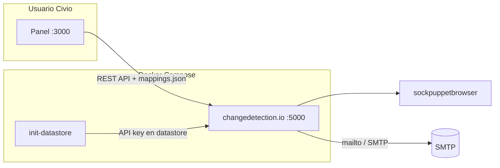

# Monitor Civio · Team Morado

**Ship for Good 2026** · Rama [`team-morado`](https://github.com/ship-for-good/civio-2026/tree/team-morado)

Sistema de monitorización de cambios en páginas web de información pública para [Civio](https://civio.es/). Los periodistas registran una URL y un email; cuando el contenido cambia, reciben una alerta sin tener que revisar el portal a mano.

## Equipo

| Nombre |
|--------|
| Sergio Arce Chijo |
| Emilio Gerdez |
| Ivan Betriu |
| Victor Gonzalez |

## Problema que resuelve

En Civio, detectar cambios en portales de transparencia, contratación u otras fuentes públicas sigue siendo un trabajo manual y fácil de olvidar (oportunidad **OPP-1b** del discovery). Este proyecto automatiza esa vigilancia: centraliza qué URLs se siguen, con qué frecuencia y a quién avisar, reduciendo el esfuerzo repetitivo y permitiendo seguimiento temático a largo plazo.

## Tecnologías principales

| Componente | Tecnología |
|------------|------------|
| Motor de detección de cambios | [changedetection.io](https://github.com/dgtlmoon/changedetection.io) (Docker) |
| Navegador headless | Sockpuppet Browser (Playwright) |
| Panel URL → email | Node.js 20 + Express |
| Orquestación | Docker Compose |
| Notificaciones | SMTP (integración vía API de changedetection.io) |
| Persistencia | JSON en volumen (`mappings.json`) + datastore de watches |

## Requisitos previos

- [Docker](https://docs.docker.com/get-docker/) y [Docker Compose](https://docs.docker.com/compose/) v2
- Puertos libres en localhost (por defecto **3000** panel y **5000** changedetection.io)
- Para desarrollo local del panel (opcional): **Node.js ≥ 20**

## Instalación y puesta en marcha

```bash
git clone https://github.com/ship-for-good/civio-2026
cd civio-2026
git checkout team-morado
cd changedetection
cp .env.example .env
# Edita .env si necesitas SMTP, otra API key o URLs en red privada (ver abajo)
docker compose up -d --build
```

Comprueba que los contenedores están en marcha:

```bash
docker compose ps
```

### Acceso local

| Servicio | URL | Uso |
|----------|-----|-----|
| **Panel de configuración** | http://127.0.0.1:3000 | Alta de URL + email, listado y borrado de monitors |
| **changedetection.io** | http://127.0.0.1:5000 | UI avanzada, historial de capturas y diffs |

### Flujo de demo (3 min)

1. Abre el panel en http://127.0.0.1:3000.
2. Añade una URL pública (p. ej. un portal de transparencia o contratación) y un email de prueba.
3. Opcional: intervalo corto (5 min) para ver un ciclo de comprobación en la demo.
4. Configura SMTP en `.env` para recibir el correo real; sin SMTP el alta de monitors fallará al crear la notificación (el motor y el panel siguen funcionando para revisar watches en el puerto 5000).
5. Cuando changedetection.io detecte un cambio, el destinatario recibe el aviso por email.

### Parar y limpiar

```bash
docker compose down
# Para borrar también el volumen de datos de watches:
docker compose down -v
```

### URLs en red privada / LAN

Si monitorizas hosts internos (p. ej. `http://10.x.x.x/...`), en `.env` define:

`ALLOW_IANA_RESTRICTED_ADDRESSES=true`

Solo en redes de confianza: aumenta el riesgo de SSRF si la UI es accesible desde fuera.

### Almacenamiento y tamaño del volumen

En Windows/macOS los volúmenes nombrados de Docker no tienen cuota fija. Opciones documentadas en `changedetection/docker-compose.yml`:

- Bind mount: `DATASTORE_VOLUME=./data` en `.env`
- Reducir capturas: `SCREENSHOT_MAX_HEIGHT` y límite de historial por watch en la UI

## Variables de entorno

Copia `changedetection/.env.example` a `changedetection/.env`. Nombres de variables (sin valores sensibles):

| Variable | Descripción |
|----------|-------------|
| `BASE_URL` | URL pública que aparece en alertas |
| `CHANGEDETECTION_PORT` | Mapeo de puerto del servicio changedetection.io |
| `CONFIG_PANEL_PORT` | Mapeo de puerto del panel |
| `TZ` | Zona horaria de las comprobaciones |
| `ALLOW_IANA_RESTRICTED_ADDRESSES` | Permitir URLs en IPs privadas/reservadas |
| `DATASTORE_VOLUME` | Ruta de volumen o bind mount para datos |
| `SCREENSHOT_MAX_HEIGHT` | Altura máxima de capturas |
| `CHANGEDETECTION_API_KEY` | API key estática (inyectada al arranque) |
| `DEFAULT_CHECK_MINUTES` | Intervalo por defecto entre revisiones |
| `SMTP_HOST` | Servidor SMTP |
| `SMTP_PORT` | Puerto SMTP |
| `SMTP_USER` | Usuario SMTP |
| `SMTP_PASSWORD` | Contraseña SMTP |
| `SMTP_SECURE` | `true` para TLS directo (p. ej. puerto 465) |
| `NOTIFICATION_EMAIL_FROM` | Remitente de las notificaciones |

Variables adicionales del panel (opcionales, con valores por defecto en Docker): `MIN_CHECK_MINUTES`, `MAX_CHECK_MINUTES`, `PORT`.

## Estructura del repositorio (equipo)

```
changedetection/
├── docker-compose.yml    # Stack: init, changedetection.io, panel, browser
├── .env.example
├── scripts/init-datastore.js
└── panel/
    ├── server.js         # API y sincronización con watches
    ├── public/           # UI del panel
    └── data/mappings.json
```

## Arquitectura



## Decisiones técnicas

- **changedetection.io** en lugar de un scraper propio: motor maduro, diffs visuales, historial y API; el equipo se centra en el flujo Civio (URL → persona).
- **Panel ligero en Express**: formulario en español, validación de URL/email e intervalo, y sincronización bidireccional panel ↔ watches (borrados huérfanos en ambos lados).
- **API key fija en arranque** (`init-datastore.js`): despliegue reproducible sin configuración manual en la UI de changedetection.io.
- **Fetch con WebDriver**: páginas con JavaScript o contenido dinámico (portales de administración).

## Próximos pasos

- Plantillas de URLs frecuentes (transparencia, contratación, BOE).
- Agrupación por tema o investigación y varios emails por watch.
- Despliegue en producción con HTTPS y secretos gestionados.
- Integración con Slack o webhook además de email.

## Trabajo en la rama del equipo

Este proyecto vive en la rama **`team-morado`**. No hagas commit en `main` ni en ramas de otros equipos.

```bash
git checkout team-morado
git push origin team-morado
```

Convención de commits recomendada: [Conventional Commits](https://www.conventionalcommits.org/) (`feat`, `fix`, `docs`, …). Detalle en [how-to-work-team-branch.md](./how-to-work-team-branch.md).

## Entrega (hackathon)

Antes del **sábado 30 de mayo · 19:00**:

- [ ] Todo el código en `team-morado` y pusheado
- [ ] Este README completo y el proyecto arranca con las instrucciones anteriores
- [ ] Demo funcional (local o desplegada)

Requisitos completos y formato de showcase: [how-to-submit-project.md](./how-to-submit-project.md).

## Licencia y uso por Civio

Código bajo **MIT License** ([LICENSE](./LICENSE)). Civio y terceros pueden usar, modificar y desplegar el proyecto. Ver [AUTHORSHIP.md](./AUTHORSHIP.md).

## Contexto del reto

- Discovery del reto: [challenge-discovery.md](./challenge-discovery.md)
- Evento: [shipforgood.org](https://www.shipforgood.org/es)

---

*Ship for Good · 1st Edition · Mayo 2026 · 42 Barcelona*
