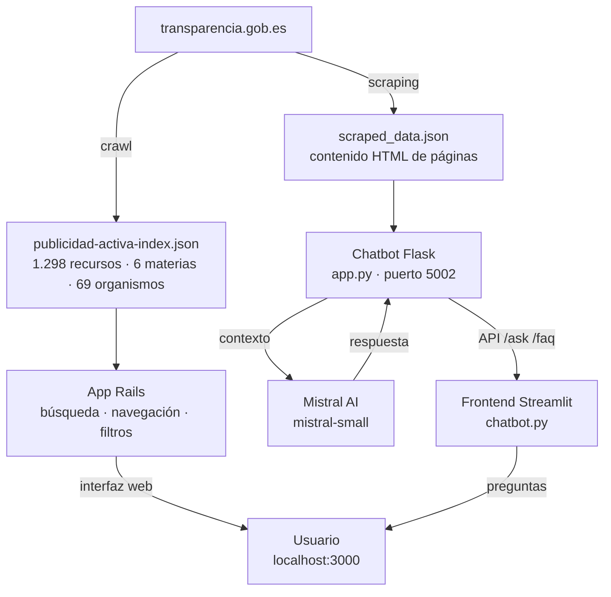

# Portal Publicidad Activa · Equipo Rosa

**Ship for Good 2026 · 42 Barcelona · 30 de mayo de 2026**

---

## El problema

El portal nacional de publicidad activa funciona como un directorio de enlaces opaco y fragmentado: sin inventario previo, con estructuras inconsistentes entre organismos y vocabulario técnico inaccesible para la ciudadanía. Localizar información concreta requiere conocimiento tácito que solo tienen periodistas expertos como los de Civio.

## Solución

Hemos reorganizado la información del portal `transparencia.gob.es/publicidad-activa` con una home explicativa con estadísticas del inventario, un buscador global y una navegación basada en organismos y filtros por materia. Incorporamos además un chatbot que permite resolver dudas en lenguaje natural. No centralizamos los datos — centralizamos **cómo se descubren**.

---

## Tecnologías principales

| Capa | Stack |
|------|-------|
| Aplicación web | Ruby on Rails 8 · SQLite · TypeScript · Tailwind CSS 4 · Hotwire (Turbo + Stimulus) |
| Chatbot (backend) | Python · Flask · Mistral AI (`mistral-small`) · BeautifulSoup4 |
| Chatbot (frontend) | Streamlit |

---

## Prerrequisitos

- **Ruby** 4.0.5 (`rbenv` o `asdf` recomendado)
- **Node.js** ≥ 20 y `npm`
- **Python** 3.10+
- **SQLite3**

---

## Instalación y arranque

### Dev Container (recomendado)

El proyecto incluye un Dev Container preconfigurado compatible con VS Code y GitHub Codespaces. Al abrirlo instala automáticamente todas las dependencias (Ruby, Node.js, Python, SQLite3) y ejecuta `bin/setup` y `pip install`.

1. Abre la carpeta `publicidad-activa/` en VS Code.
2. Acepta la notificación _"Reopen in Container"_ (o usa `Dev Containers: Reopen in Container` desde la paleta de comandos).
3. Espera a que el contenedor se construya y el `postCreateCommand` finalice.

Una vez dentro del contenedor:

```bash
# Arrancar la app Rails
bin/dev   # disponible en http://localhost:3000

# Arrancar el chatbot (en otra terminal)
cd chatbot
python app.py          # backend Flask → puerto 5002
streamlit run chatbot.py  # frontend Streamlit
```

Los puertos 3000 y 5002 se reenvían automáticamente al host.

> **Variables de entorno:** el Dev Container espera `MISTRAL_API_KEY` definida en el entorno del host (o en un archivo `.env` local). Ver sección [Variables de entorno](#variables-de-entorno-requeridas).

### Manual (sin contenedor)

```bash
git clone https://github.com/ship-for-good/civio-2026
cd civio-2026/publicidad-activa

bin/setup
bin/dev  # Rails en http://localhost:3000

# Chatbot (otra terminal)
cd chatbot
pip install -r requirements.txt
python app.py
streamlit run chatbot.py
```

### Docker (producción)

El `Dockerfile` usa una build multietapa optimizada para producción. El entrypoint ejecuta `db:prepare` automáticamente al arrancar.

```bash
cd publicidad-activa

docker build -t publicidad_activa .

docker run -d -p 80:80 \
  -e RAILS_MASTER_KEY=<valor de config/master.key> \
  --name publicidad_activa \
  publicidad_activa
```

La app queda disponible en `http://localhost`.

---

## Variables de entorno requeridas

| Variable | Descripción |
|----------|-------------|
| `RAILS_MASTER_KEY` | Clave maestra de Rails (requerida solo en Docker/producción) |
| `MISTRAL_API_KEY` | Clave de API de Mistral AI para el chatbot |

---

## Arquitectura

```
civio-2026/
├── publicidad-activa/       ← App Rails (interfaz principal)
│   ├── app/                 ← Controladores, vistas, modelos
│   ├── chatbot/             ← Chatbot Python (Flask + Streamlit)
│   │   ├── app.py           ← Backend Flask (API /ask y /faq)
│   │   ├── chatbot.py       ← Frontend Streamlit
│   │   └── scraped_data.json ← Datos extraídos del portal
│   └── data/                ← Índices JSON del crawl
└── docs/
    └── publicidad-activa-mvp.md
```

**Inventario indexado:**

| Métrica | Valor |
|---------|-------|
| Total recursos | 1.298 URLs |
| Materias | 6 (organización y empleo: 1.120 · altos cargos: 77 · económico-presupuestaria: 42 · trámites: 25 · normativa: 19 · planificación: 12) |
| Organismos únicos | 69 |
| Recursos vigentes | 353 |
| Recursos históricos | 945 |
| Tipos de contenido | RPT: 720 · Estructura: 150 · Funciones: 104 · Normativa: 51 · RAT: 29 |

**Flujo de datos:**



---

## Próximos pasos

- Profundizar en la arquitectura de la información y analizar las fuentes de datos primarias (BOE, portales ministeriales, plataforma de contratación).
- Entender mejor el ecosistema de transparencia para construir una solución escalable basada en necesidades reales de los usuarios.
- Añadir niveles de seguridad: autenticación, rate limiting en la API del chatbot y gestión segura de claves (variables de entorno en lugar de valores en código).
- Ampliar el catálogo curado de organismos (`organismos.json`) y tips de Civio (`fuentes-civio.json`).
- Soporte de alertas de cambios en URLs monitorizadas.

---

## Equipo

**Equipo Rosa** · Ship for Good 2026 · [Civio](https://civio.es/)
