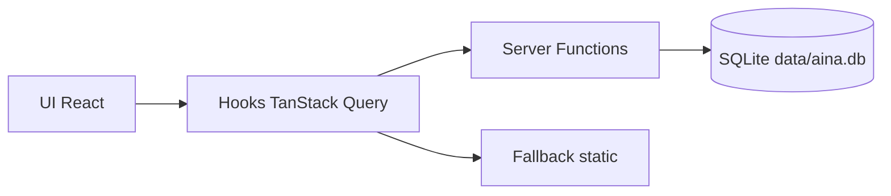

# AIna de Transparència

Equip: Team Aina  
Hackathon: [Ship for Good 2026](https://www.shipforgood.org/es) x [Civio](https://civio.es/)

> La transparència pública, al teu abast.  
> Pregunta. Descobreix. Entén.

## Motivació

La informació pública existeix, però sovint és difícil de trobar i d'entendre:

- està repartida entre molts portals i formats,
- utilitza vocabulari tècnic (CPV, expedients, procediments),
- i pressuposa coneixement expert sobre on buscar primer.

AIna vol reduir aquesta barrera. El projecte neix per apropar la transparència a qualsevol persona, no només a perfils especialitzats en periodisme de dades o dret administratiu.

## Què és el projecte

**AIna de Transparència** és una aplicació web en català que centralitza l'exploració de dades públiques en una experiència senzilla.

Actualment ofereix tres espais principals:

- **Què passa a prop meu?**: mapa i taula d'elements de territori.
- **Temes populars**: temàtiques consultades amb context i enllaços.
- **Potser t'has perdut això**: publicacions destacades amb font oficial.

També incorpora un **xat de portada** (prototip d'experiència conversacional).

## Estat actual (important)

- Interfície funcional en català.
- Navegació completa amb rutes i panells de contingut.
- Flux de dades amb DB local i fallback.
- Xat de portada amb UX completa (input, suggeriments, enviament).
- **No hi ha IA de producció connectada encara**: la resposta del xat és de prototip local.

## D'on surten les dades

Les dades es carreguen principalment des de SQLite local (`data/aina.db`), generada per script.

### Fonts i ingestió actuals

- **Seed principal**: `data/seed-content.json`
- **Generació DB**: `scripts/seed.mjs`
- **Taules creades**:
  - `example_questions`
  - `topics`
  - `featured_items`
  - `nearby_items`
  - `popular_topics`
  - `popular_topic_summaries`
  - `popular_topic_articles`
- **Licitacions verificades** per al panell territorial: `src/data/barcelona-tenders-verified.ts`

### Fallback

Si la DB no està disponible, el client no queda en blanc: hi ha dades alternatives a `src/data/fallback.ts`.

## Com funciona (end-to-end)

Flux funcional simplificat:

1. Els components de UI consumeixen hooks de `src/hooks/use-aina-queries.ts`.
2. Els hooks llancen consultes amb TanStack Query.
3. Les consultes invoquen server functions (`createServerFn`) a `src/lib/api/aina.functions.ts`.
4. La capa servidor consulta SQLite a `src/lib/db/client.server.ts`.
5. Si alguna consulta falla, el hook retorna fallback estàtic.

Server functions actuals:

- `getHealth`
- `getExampleQuestions`
- `getTopics`
- `getPopularTopics`
- `getFeatured`
- `getNearby`

## Stack tecnològic

### Frontend

- React 19
- TypeScript
- TanStack Router / TanStack Start
- TanStack Query

### UI i estils

- Tailwind CSS 4
- shadcn/ui
- Radix UI
- Lucide React

### Dades i servidor

- SQLite amb `sql.js`
- Server functions via `createServerFn`
- Entrades de servidor a `src/server.ts` i `src/start.ts`

### Tooling

- Vite 7
- ESLint
- Prettier

## Arquitectura



Arquitectura de carpetes clau:

```text
src/
  components/aina/         Components de producte
  routes/                  Rutes de l'aplicació
  hooks/                   Capa client de consultes
  lib/api/                 Server functions
  lib/db/                  Accés a SQLite
  data/                    Dades client i assets mapatge
scripts/
  seed.mjs                 Construcció de data/aina.db
  fetch-storyset-featured.mjs
docs/
  AI_CONTEXT.md
  lovable-stack.md
```

## Requisits

- Node.js >= 20.19 (recomanat >= 22.12)
- npm o bun

## Instal·lació i execució

### Opció npm

```bash
git clone https://github.com/ship-for-good/civio-2026
cd civio-2026
git checkout team-aina
npm install
npm run db:seed
npm run dev
```

### Opció bun

```bash
bun install
bun run db:seed
bun run dev
```

URL local per defecte: `http://localhost:5173`

## Scripts disponibles

| Script | Què fa |
| --- | --- |
| `npm run dev` | Arrenca desenvolupament |
| `npm run build` | Build de producció |
| `npm run build:dev` | Build en mode development |
| `npm run preview` | Serveix la build localment |
| `npm run db:seed` | Regenera `data/aina.db` |
| `npm run assets:storyset-featured` | Baixa/regenera il·lustracions destacades |
| `npm run lint` | Lint del codi |
| `npm run format` | Format Prettier |
| `npm run format:check` | Comprovació de format |

## Variables d'entorn

Fitxer d'exemple: `.env.example`

| Variable | Obligatòria | Descripció |
| --- | --- | --- |
| `VITE_GOOGLE_MAPS_EMBED_URL` | No | URL embed de mapa per al panell territorial |

Nota: qualsevol variable `VITE_*` es publica al client. No hi guardis secrets.

## Limitacions actuals

- No hi ha assistent IA real connectat a fonts en temps real.
- Cobertura de dades encara parcial (focus en demo i cas d'ús inicial).
- No hi ha suite de tests automatitzats definida als scripts.
- No hi ha sistema d'alertes d'actualització per usuari final.

## Full de ruta (futur)

### Prioritat alta

1. **Scraping complet de portals de transparència**
	- Cobrir administració general, autonòmica i local.
	- Detectar noves seccions, canvis d'estructura i documents nous.
	- Normalitzar metadades (organisme, tema, territori, data, URL font).

2. **MCP real per consultes verificables**
	- Construir un servidor MCP amb eines de cerca, lectura i traçabilitat de fonts.
	- Respostes amb cites i enllaços oficials, no text opac.
	- Suport per consultes guiades per ciutadania i per redacció.

3. **Sistema d'alertes per correu electrònic**
	- Subscripcions per tema, territori, organisme o paraula clau.
	- Alertes de canvi (publicació nova, modificació, caducitat de termini).
	- Frequència configurable (instant, diari, setmanal).

### Bones idees addicionals

1. **Índex de qualitat de transparència per organisme**
	- Completitud, actualització i facilitat d'accés.
	- Rànquing públic i evolució temporal.

2. **Glossari ciutadà automàtic**
	- Traducció de vocabulari tècnic (CPV, procediment obert, expedient).
	- Explicacions curtes contextuals dins de cada resultat.

3. **Timeline d'expedients i canvis**
	- Històric de què es publica, quan i per qui.
	- Vista comparativa entre organismes.

4. **Motor de cerca semàntica + filtres avançats**
	- Cerca per intenció en llenguatge natural.
	- Filtres combinats: data, import, territori, organisme, estat.

5. **Espai per periodisme i recerca**
	- Export CSV/JSON d'evidències.
	- Dossiers de tema amb fonts verificades i seguiment automàtic.

6. **Observabilitat i qualitat de dades**
	- Monitoratge de pipelines (scrapers, parser, ingestió).
	- Alertes internes quan una font cau o canvia HTML/API.

### Evolució de producte recomanada

Fase 1: robustesa de dades (scraping + normalització + alertes internes).  
Fase 2: experiència d'usuari (alertes email, cerca avançada, glossari).  
Fase 3: intel·ligència assistida (MCP, citacions automàtiques, workflows periodístics).

## Documentació relacionada

- [docs/AI_CONTEXT.md](docs/AI_CONTEXT.md)
- [docs/lovable-stack.md](docs/lovable-stack.md)
- [src/routes/README.md](src/routes/README.md)
- [sfg/challenge-discovery.md](sfg/challenge-discovery.md)
- [sfg/how-to-work-team-branch.md](sfg/how-to-work-team-branch.md)
- [sfg/how-to-submit-project.md](sfg/how-to-submit-project.md)

## Llicència i autoria

- Llicència: [MIT](sfg/LICENSE)
- Autoria i ús del codi: [sfg/AUTHORSHIP.md](sfg/AUTHORSHIP.md)
