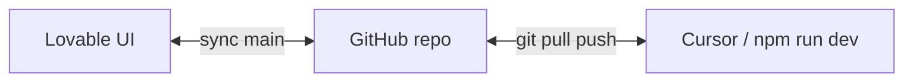

# Iterar amb Lovable sobre el codi que ja tenim

Aquest repo **ja és plantilla Lovable** (TanStack Start + React). No cal tornar a Vue. El que cal és **enllaçar el projecte Lovable amb GitHub** i acordar qui toca què (UI vs dades).

## Requisit: Lovable Pro + GitHub

Al hackathon teniu crèdits Pro ([sfg/lovable-tokens.md](../sfg/lovable-tokens.md)). La **sincronització bidireccional amb GitHub** només funciona amb pla de pagament:

1. [lovable.dev](https://lovable.dev) → **Settings** → **Git** / **Connectors** → **GitHub** → autoritzar l’app.
2. Dins del **projecte Lovable** (el que vau crear per AIna): icona GitHub o **Project settings** → **Connect project**.
3. Lovable crea un repo nou i hi puja el codi del núvol.

Documentació oficial: [Connect to GitHub](https://docs.lovable.dev/integrations/github).

**Important:** Lovable **no importa** un repo existent directament. El repo de GitHub el crea Lovable; després hi poseu el vostre codi (pas 3).

---

## Escenari A — Ja teniu projecte Lovable (recomanat)

És el cas típic: vau prototipar a Lovable i també treballeu a `team-aina` local.



### Pas 1 — Connectar GitHub des de Lovable

- Connecteu el projecte → Lovable genera `usuario/aina-xxx` (nom orientatiu).
- **No reanomenieu ni esborreu** aquest repo després de connectar (es trenca el sync).

### Pas 2 — Portar el codi actual al repo de Lovable

En local (rama `team-aina`):

```bash
# Cloneu el repo QUE HA CREAT Lovable (no civio-2026 directament si són diferents)
git clone https://github.com/TU_ORG/repo-lovable-aina.git
cd repo-lovable-aina

# Substituïu el contingut pel del hackathon (menys .git)
rsync -av --exclude .git /ruta/a/civio-2026/ .

git add .
git commit -m "feat: sync team-aina codebase (UI + SQLite + server functions)"
git push origin main
```

Refresqueu Lovable: hauríeu de veure **AIna**, `src/components/aina/`, etc.

### Pas 3 — Dia a dia: qui edita què

| Canvi | On fer-ho |
|-------|-----------|
| Layout, colors, hero, targetes, copy UI | **Lovable** (prompts) |
| SQLite, `createServerFn`, hooks, seed | **Cursor** (local) |
| Text del xat / typewriter (lògica React) | **Cursor** (Lovable sovint trenca hooks subtils) |

Després de prompts a Lovable:

```bash
git pull origin main   # o la branca activa del sync
npm install
npm run db:seed
npm run dev
```

Comproveu que no s’hagi esborrat:

- `src/lib/api/aina.functions.ts`
- `src/lib/db/`
- `src/hooks/use-aina-queries.ts`
- `data/aina.db` (local, no es puja; cal `db:seed`)

### Pas 4 — Pujar el vostre treball local cap a Lovable

```bash
git add .
git commit -m "feat: ..."
git push origin main
```

Els commits a `main` del repo enllaçat **tornen a aparèixer a Lovable**.

---

## Escenari B — Només repo `ship-for-good/civio-2026` (sense projecte Lovable nou)

1. Creeu un projecte Lovable amb la **mateixa plantilla** (`tanstack_start_ts`) i el prompt inicial d’AIna.
2. Connecteu GitHub (repo nou de Lovable).
3. Feu el **Pas 2** de dalt: copieu `civio-2026` dins aquell repo i push.
3. Opcional: afegiu el repo de Lovable com a `remote` extra del clone de civio si voleu un sol directori de treball.

La rama oficial del hackathon segueix sent **`team-aina`** a `civio-2026`; podeu fer mirror o PRs entre repos segons preferiu l’organització.

---

## Escenari C — Sense GitHub sync (pla free / avui no connectem)

1. Itereu UI a Lovable.
2. **Download / Export** del codi o copieu fitxers concrets (`ChatHero.tsx`, `styles.css`, etc.).
3. Enganxeu manualment a `src/components/aina/` al repo local.
4. Reviseu amb Cursor que no s’hagi perdut `useMemo`, server functions ni imports `@/`.

Més lent però vàlid per a canvis petits.

---

## Prompts útils dins Lovable (mantenir el que ja tenim)

Enganxeu això al xat de Lovable abans de demanar canvis grans:

```
Stack: TanStack Start, React 19, Tailwind 4, shadcn.
UI en català. Producte: AIna de Transparència.
NO esborris src/lib/db/, src/lib/api/aina.functions.ts, src/hooks/use-aina-queries.ts.
NO afegeixis Supabase ni backend extern: dades via createServerFn + SQLite local.
Components de producte a src/components/aina/. Pàgina principal: src/routes/index.tsx.
```

---

## Conflictes habituals

| Problema | Solució |
|----------|---------|
| Lovable regenera `vite.config.ts` | No toqueu plugins; només `@lovable.dev/vite-tanstack-config` |
| Desapareix la DB / panells buits | Restaureu `aina.functions.ts` + hooks; `npm run db:seed` |
| Typewriter mostra només "q" | No reescriviu `ChatHero` sense `useMemo` al llistat de frases |
| Node massa vell | TanStack Start demana Node ≥ 22.12 (o ≥ 20.19) |

---

## Resum ràpid

1. **Pro + Connect GitHub** al projecte Lovable.  
2. **Push del codi `team-aina`** al repo que crea Lovable.  
3. **UI a Lovable**, **dades i lògica a Cursor**, **git pull/push** per sincronitzar.  
4. Sempre **`npm run dev` + `db:seed`** després de fusionar.

Més context IA: [AI_CONTEXT.md](./AI_CONTEXT.md).
