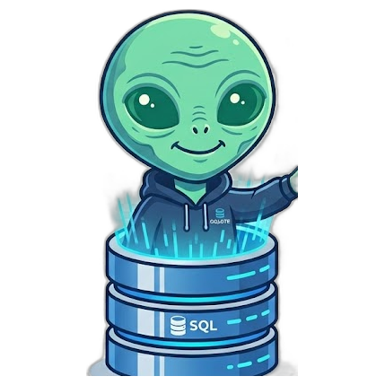

<!-- _paginate: false -->
<!-- _class: center -->

# SQLete

El derecho de acceso a la información, <strong>sin que se te escape un plazo</strong>.

Reto OPP-2 · Civio · Hackathon Software Crafters

<!--
0:00–0:10 · Portada.
"Somos SQLete. Convertimos el caos de las solicitudes de transparencia en plazos que no se escapan."
-->

---

## El trabajo de detective

Hoy, un periodista de Civio para **cada** notificación tiene que:

- Entrar al portal **con certificado digital**
- Descargar el PDF y abrirlo… **solo para saber qué es**
- Calcular a mano los plazos legales
- Repetirlo por **decenas de expedientes en paralelo**

Y si se le pasa un plazo → **derecho perdido.**

Spoiler: el certificado digital siempre caduca el día que lo necesitas.

<!--
0:10–0:40 (30s) · El dolor.
Es un email opaco; entras con certificado, bajas el PDF y lo abres solo para saber qué es. Por decenas de expedientes. Un plazo que se pasa = derecho perdido.
-->

---

## ¿Qué hace SQLete?

Arrastras el PDF de una notificación → la app lo interpreta sola, calcula todos los plazos legales y te avisa de lo que vence.

  
<b>📄</b>Sueltas el PDF

  
<b>👽</b>IA clasifica + extrae

  
<b>📅</b>Calcula plazos

  
<b>📊</b>Dashboard

  
<b>🔔</b>Te avisa

Sin OCR, sin pócimas, sin sacrificar a un becario.

<!--
0:40–0:55 · Qué es, en una frase. El "upgrade" de la Airtable que Civio ya usa.
-->

---

## Demo · arrastra y suelta

Suelto un PDF <strong>real del Consejo de Transparencia</strong>…

SQLete responde, en segundos:

- **Tipo:** resolución parcial
- **Organismo:** Ministerio X
- **Fecha de inicio de tramitación:** la saca del propio documento
- Salida **estructurada** → no se inventa campos; si duda, lo marca para revisión

Tarda menos en leerlo que tú en encontrar dónde se descargaba.

<!--
0:55–1:35 · DEMO (en vivo si va fino; captura si no). 35+ PDFs reales del CTBG cargados.
-->

---

## El motor de plazos

En cuanto entra la notificación, SQLete calcula **solo**:

- **Silencio negativo (art. 20.4)** → si vence sin respuesta, se entiende denegado
- **Prórroga del art. 20.1** (volumen) → 1 mes ➜ 2 meses
- **Ventana de reclamación al CTBG** → cuántos días te quedan

Dashboard con **semáforo**: rojo vence ya · ámbar pronto · verde en plazo.

El silencio administrativo es negativo. El nuestro, al menos, te avisa.

<!--
1:35–2:15 · Dashboard + plazos. Reemplaza su Airtable manual. Tests con las fechas reales del CSV de Civio.
-->

---

## Redistribución · lo que ningún Airtable hace

Detectamos cuando <strong>1 solicitud se multiplica en 22 expedientes</strong>, uno por ministerio…

…y los **agrupamos** con los plazos de cada hijo. Se acabó el trabajo de detective cruzando referencias a mano.

Determinista: parseamos el campo "Notas" del propio CSV de Civio.

Una solicitud, 22 ministerios. La Administración multiplicándose como gremlins.

<!--
2:15–2:45 · Feature distintivo. parent_id por parseo de Notas (datos reales).
-->

---

<!-- _class: center -->

## Impacto

  Sustituye su Airtable manual
  Elimina el trabajo de detective
  No se escapa un plazo

 

<strong>Open source (MIT)</strong> · Phoenix LiveView + PostgreSQL · reutilizable por Civio

Que el trabajo de detective lo haga el alien. Tú, a hacer periodismo.

<!--
2:45–3:00 · Cierre. NO decir "Somos SQLete". Rematar con el chascarillo y dejar el dashboard en pantalla.
-->
