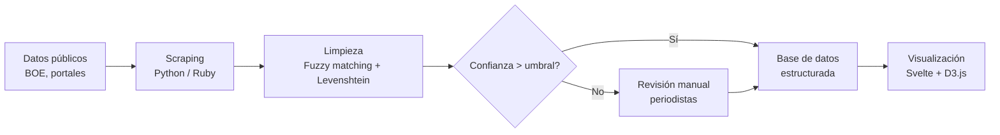

---
tags:
  - civio
  - resumen
  - operativa
  - hackathon
  - referencia
title: "Resumen Operativa de Civio"
aliases:
  - Operativa Civio
  - Cómo trabaja Civio
---

# Resumen Operativa de Civio

Civio es una fundación sin ánimo de lucro que combina **periodismo de datos, ingeniería de software y litigios legales** para fiscalizar a la administración pública española y exigir transparencia.

> [!info] Fuente
> Este documento es una síntesis del análisis completo en [[Preparación Hackathon Civio_ Contexto Técnico]]. Ver también [[informe-repos-civio]] y [[analisis-monorepo-civio]] para contexto ampliado.

---

## Flujo operativo principal

### 1. Extracción masiva de datos (scraping)

- **Fuente principal**: BOE, sección 5A de contratación
- **Formato**: XML (evitan PDF/OCR por errores estructurales)
- **Lenguajes**: Python, Ruby — ver [[repos-civio/scraper-pge]]
- **Bibliotecas**: `lxml.etree`, `urllib2`, `MySQLdb`
- **Frecuencia**: Ingesta diaria e ininterrumpida

> [!quote] Metodología
> *"Descartamos el PDF. Procesar masivamente OCR tiene un margen de error inaceptable. Descargamos los metadatos XML que la propia infraestructura del BOE provee."*

### 2. Limpieza y normalización de datos

| Fase | Qué hace |
|---|---|
| Automática | Algoritmos de fuzzy string matching + distancia de Levenshtein para agrupar entidades |
| Manual | Registros bajo umbral de confianza → cola de revisión periodística |

- **Problema base**: errores tipográficos, variaciones en nombres de empresas, NIF faltantes, importes erróneos
- **Salida**: Bases de datos relacionales limpias publicadas en `datos.civio.es` con licencia CC BY-SA 3.0

### 3. Visualización de datos

- **Stack**: [[repos-civio/civio-graphs-public|Svelte 5 + Vite 7 + D3.js]]
- **Svelte**: Compila a JS puro en build time — bundles pequeños, carga rápida en móviles
- **D3.js**: Control total sobre SVG (sin Tableau ni herramientas propietarias cerradas)
- **Patrón de integración**: D3.js para matemáticas/escalas; Svelte para renderizado reactivo del DOM

> [!warning] Complejidad técnica
> D3.js manipula el DOM imperativamente, Svelte es declarativo. La integración requiere encapsular selecciones D3 dentro de `onMount()` y usar `:global()` en CSS para evitar colisiones con el hashing de Svelte.

### 4. Agentes LLM (asistencia, no reemplazo)

- **Herramienta**: [[repos-civio/pi-mono]] — orquestador open source de agentes en TypeScript
- **Usos**: monitorización de portales, extracción de entidades en sentencias legales, resumen documental
- **Regla estricta**: ==Human-in-the-loop== — nada se publica sin verificación humana

> [!example] Ciclo de uso de IA
> 1. Agente LLM extrae entidades nominativas de 10.000 folios de contratos
> 2. Periodista especializado audita, contrasta y verifica cada resultado
> 3. Solo entonces se incorpora a la base de datos pública

---

## Grandes batallas legales

### Caso BOSCO — Sentencia 1119/2025 ^caso-bosco

> [!danger] El problema
> Algoritmo del Ministerio para la Transición Ecológica que decidía el acceso al **bono social eléctrico**. Tras su implantación en 2018, los beneficiarios cayeron de ~2,5M a ~1,5M hogares, rechazando sistemáticamente a viudas pensionistas con derecho legal.

| Hito | Fecha |
|---|---|
| Implementación BOSCO | 2018 |
| Negativa del gobierno a entregar el código | 2019-2024 |
| Sentencia Audiencia Nacional (denegatoria) | Abril 2024 |
| Recurso de casación nº 7878/2024 | 2024 |
| **Sentencia del Tribunal Supremo** | **11 septiembre 2025** |

**Doctrina establecida**: El código fuente de algoritmos públicos **no está protegido** por propiedad intelectual frente al derecho de acceso. Los sistemas que deciden derechos sociales deben ser auditables, explicables y transparentes.

> [!quote] Tribunal Supremo
> *"La transparencia algorítmica es un derecho constitucional ejercitable, derivado de exigencias de democracia y transparencia, e inseparablemente unido al Estado democrático y de Derecho."*

Ver [[Preparación Hackathon Civio_ Contexto Técnico#La Sentencia Histórica del Tribunal Supremo de 2025|detalle completo de la sentencia]].

### Caso Zolgensma — Opacidad farmacéutica (en curso 2026) ^caso-zolgensma

- **Terapia génica** de Novartis para atrofia muscular espinal
- **Coste**: 1.340.000 €/dosis, el medicamento más caro financiado por el SNS
- **Problema**: El precio real negociado (con descuentos) es secreto de Estado bajo el artículo 97.3 de la Ley de Garantías
- **Táctica del gobierno** (marzo 2026): Insertaron la **Enmienda 259** dentro de una ley de discapacidad para blindar la opacidad — Civio la detectó mediante monitoreo automatizado del BOE
- **Estado**: Recurso de casación ante el Tribunal Supremo

> [!warning] Relevancia técnica
> La detección de la Enmienda 259 demuestra el valor del monitoreo legislativo automatizado. Sin scrapers + alertas, la opacidad se habría blindado sin escrutinio público.

---

## Coalición IA Ciudadana ^ia-ciudadana

> [!tip] Objetivo
> Crear un **Registro Central Obligatorio de Algoritmos del Estado**

Coalición de 17 organizaciones (Civio, Political Watch, Algorights, Iridia, CECU, Amnistía Internacional...) que presiona a SEDIA y AESIA.

**Problema de fondo**: El Reglamento de IA de la UE (2024) solo cubre sistemas de "alto riesgo", excluyendo algoritmos deterministas (BOSCO, asignación de empleo público, notas de corte universitarias) que son los que más impacto tienen en la ciudadanía.

**5 pilares del registro**:

1. **Contexto político**: agencia responsable, presupuesto, base legal, contratación
2. **Integración funcional**: ¿human-in-the-loop o decisión autónoma?
3. **Arquitectura técnica**: flujos de datos, código fuente, variables, sesgos
4. **Evaluaciones de riesgo**: EIPD, auditorías algorítmicas, simulaciones
5. **Rendición de cuentas**: mecanismos de apelación, punto de contacto humano, algoritmos retirados

> [!example] Oportunidad para hackathon
> Prototipar la base de datos y API pública de este registro, con modelos entidad-relación que cubran los 5 pilares y visualización en [[repos-civio/civio-graphs-public|Svelte + D3.js]].

---

## Stack tecnológico

| Capa | Tecnología | Repo relacionado |
|---|---|---|
| Visualización | **Svelte 5 + Vite 7 + D3.js** | [[repos-civio/civio-graphs-public]] |
| Backend / APIs | Node.js / Express | [[repos-civio/verba]] |
| Scraping | **Python**, **Ruby** | [[repos-civio/scraper-pge]] |
| Agentes LLM | **pi-mono** (TypeScript) | [[repos-civio/pi-mono]] |
| Búsqueda | ElasticSearch 7 | [[repos-civio/verba]] |
| Mapas | TopoJSON + d3-composite-projections | `es-atlas` |
| Presupuestos | Django + jQuery (legado) → Svelte | [[repos-civio/presupuesto]] |

Ver [[mapa-dominios-civio]] para la representación visual del ecosistema de repositorios.

---

## Modelo de financiación

- **Prohibición absoluta**: donativos anónimos — el 100% de aportaciones privadas requiere identidad verificable
- **Base**: socios recurrentes atomizados + subvenciones públicas auditadas
- **Ventaja fiscal**: las donaciones tienen deducciones en IRPF (ej: donar 12 €/mes cuesta 2,40 € reales)
- **Equipo**: ~10 profesionales estables (periodistas, ingenieros full-stack, abogados)

> [!quote] Informe de gestión 2024
> *"La única metodología para proteger la independencia analítica es una tesorería diversificada y auditable, publicando cada año el desglose completo de ingresos."*

---

## Principios rectores

1. **Open source**: todo el código en [github.com/civio](https://github.com/civio) — 61 repos públicos
2. **Sin cajas negras**: rechazan herramientas propietarias (no Tableau, no SIG cerrados)
3. **Human-in-the-loop**: la IA asiste, el humano decide y verifica
4. **Transparencia total**: finanzas auditadas y publicadas, donantes identificados
5. **Persistencia judicial**: litigios que duran años (BOSCO ~5 años) hasta el Tribunal Supremo

---

> [!note] Documentos relacionados
> - [[informe-repos-civio]] — Visión general del ecosistema y stack recomendado
> - [[analisis-monorepo-civio]] — Blueprint de monorepo y arquitectura por dominios
> - [[Preparación Hackathon Civio_ Contexto Técnico]] — Análisis estratégico completo (fuente original)
> - [[mapa-dominios-civio]] — Mapa visual de dominios y repositorios
> - [[repos-civio/pi-mono]] — Nota detallada del orquestador de agentes LLM
> - [[repos-civio/civio-graphs-public]] — Nuevo estándar de visualización (Svelte 5 + D3)
