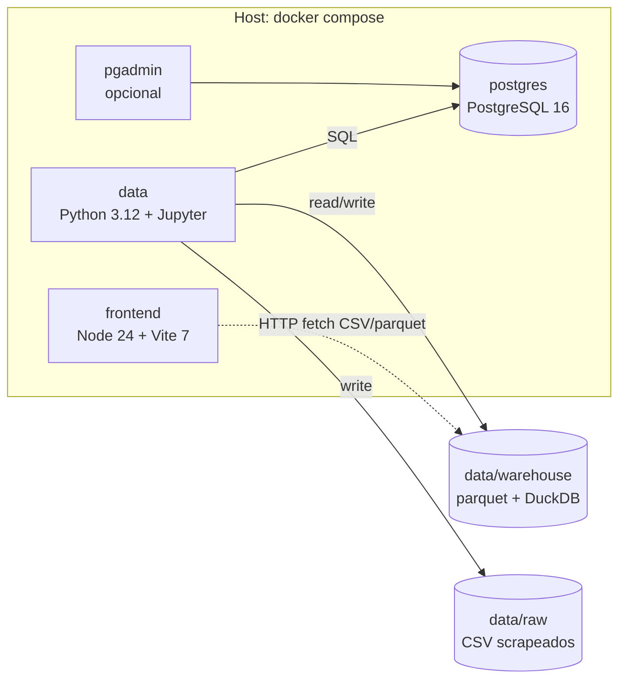

---
tags:
  - civio
  - hackathon
  - docker
  - entorno
  - infraestructura
title: "Entorno dockerizado para hackathon Civio"
aliases:
  - Entorno docker
  - Dev environment hackathon
---

# Entorno dockerizado para hackathon Civio

Diseño del entorno de desarrollo **portable y reproducible** para el equipo que prepara la hackathon de [[Civio]]. Este documento es un blueprint — describe **qué** queremos montar y **por qué**, antes de escribir un solo `Dockerfile`.

> [!info] Estado
> Documento de diseño. El repo `bsc-civio-delfos` ahora mismo solo contiene el vault de Obsidian. La implementación (docker-compose, Dockerfiles, esqueleto de paquetes) es la siguiente fase, fuera del alcance de esta nota.

---

## 1. Resumen y objetivos

### Equipo

- **3 ingenieros de datos** — scraping, ETL, modelado, análisis.
- **1 frontend** — visualización interactiva.

### Objetivos

- Cualquier miembro clona el repo y arranca el entorno con **`docker compose up`** en menos de 5 minutos.
- Funciona igual en **macOS, Linux y Windows** (vía Docker Desktop o equivalente).
- **Cero dependencias** en la máquina host más allá de Docker. No hay que instalar Python, Node, Postgres ni gestores de versiones.
- Cada stack vive en **su propio contenedor**, aislado y desechable.
- Volúmenes persistentes para BD y datasets — apagar y volver a encender no pierde trabajo.

### Out of scope

- Producción y despliegue.
- CI/CD.
- Migración al monorepo descrito en [[analisis-monorepo-civio]]. Este entorno es el primer paso, pero la estructura de paquetes se mantiene compatible con esa visión.

---

## 2. Decisiones de stack

Decisiones derivadas del análisis en [[informe-repos-civio]] y [[analisis-monorepo-civio]], ajustadas a la composición del equipo (data-heavy).

| Capa | Elección | Justificación |
|---|---|---|
| Lenguaje DE | **Python 3.12** | 3 de 4 miembros. Sustituye Ruby de los scrapers Civio para unificar el equipo. |
| Scraping | **`httpx` + `selectolax`** (estático), **`playwright`** (dinámico) | Reemplazo Python del patrón Ruby `fetch.rb → parse.rb` documentado en [[informe-repos-civio]]. |
| Procesamiento | **`polars`** + **`pandas`** | Polars para rendimiento; pandas como compatibilidad con el ecosistema Jupyter. |
| Análisis local | **DuckDB** | SQL sobre CSV/parquet sin servidor. Ideal para exploración rápida. |
| BD relacional | **PostgreSQL 16** | Alineado con DVMI ([[repos-civio/presupuesto]]). Persistencia compartida entre el equipo. |
| Notebooks | **JupyterLab** | Exploración interactiva — herramienta natural de los DE. |
| Frontend | **Svelte 5 + Vite 7 + D3 7** | Stack actual de [[repos-civio/civio-graphs-public]]. Confirmado como nuevo estándar de Civio. |
| Node | **24 LTS** | Requerido por Svelte 5 y Vite 7. |
| Linter Python | **`ruff`** | Estándar moderno, mismo criterio que `oxlint` en [[analisis-monorepo-civio]]. |
| Formateo JS | **Prettier** | Coherente con `civio-graphs-public`. |

### Por qué Python en vez de Ruby

El patrón clásico de Civio (`fetch.rb → parse.rb → CSV`) es trasladable 1-a-1 a Python:

```
fetch.py  → httpx / playwright
parse.py  → selectolax / lxml
output    → polars.DataFrame.write_csv() / .write_parquet()
```

A cambio de perder compatibilidad directa con los scrapers existentes, ganamos:

- Un único lenguaje en toda la capa de datos (scraping + ETL + análisis).
- Acceso al ecosistema Python (pandas, polars, duckdb, jupyter, sqlalchemy).
- Cohesión total del equipo: 3 DEs trabajando en el mismo stack.

---

## 3. Arquitectura de contenedores



### Servicios

| Servicio | Imagen base | Puerto | Volúmenes | Función |
|---|---|---|---|---|
| `postgres` | `postgres:16` | 5432 | `postgres_data` (volumen nombrado) | BD relacional compartida |
| `data` | `python:3.12-slim` (custom) | 8888 (Jupyter) | `./packages/data`, `./data/raw`, `./data/warehouse` | Scrapers + ETL + notebooks |
| `frontend` | `node:24-alpine` (custom) | 5173 (Vite) | `./packages/frontend`, `./data/warehouse` (read-only) | UI Svelte |
| `pgadmin` (opcional) | `dpage/pgadmin4` | 5050 | — | Admin GUI para Postgres |

> [!note] DuckDB no es un contenedor
> DuckDB se usa como **librería embebida** dentro del contenedor `data`. Los archivos `.duckdb` viven en `./data/warehouse/` y se acceden vía `duckdb.connect()`. No necesita servidor.

### Red

Una sola red `civio-net` para que `data` resuelva `postgres` por nombre DNS (`postgres:5432`).

### Volúmenes y persistencia

| Ruta host | Montaje en contenedor | Persistencia | Propósito |
|---|---|---|---|
| `./packages/data` | `/app` (data) | git | Código Python |
| `./packages/frontend` | `/app` (frontend) | git | Código Svelte (HMR activo) |
| `./data/raw` | `/data/raw` (data) | local, gitignored | CSVs crudos de scrapers |
| `./data/warehouse` | `/data/warehouse` (data, frontend ro) | local, gitignored | Parquet + DuckDB consolidados |
| `postgres_data` | `/var/lib/postgresql/data` | volumen Docker | BD persistente entre `docker compose down` |

---

## 4. Estructura propuesta del repo

```
bsc-civio-delfos/
├── docker-compose.yml
├── .env.example
├── Makefile                    # atajos comunes
├── README.md                   # cómo arrancar el entorno
│
├── packages/
│   ├── data/                   # Capa DE
│   │   ├── Dockerfile
│   │   ├── pyproject.toml      # uv / pip
│   │   ├── ruff.toml
│   │   ├── notebooks/          # JupyterLab
│   │   ├── scrapers/
│   │   │   ├── _base/          # cliente HTTP + helpers comunes
│   │   │   ├── pge/            # scraper PGE (port del Ruby)
│   │   │   └── ccaa/           # scraper CCAA
│   │   ├── etl/
│   │   │   ├── loaders/        # CSV/parquet → Postgres
│   │   │   └── transforms/     # SQL DuckDB
│   │   └── tests/
│   │
│   └── frontend/               # Capa FE
│       ├── Dockerfile
│       ├── package.json
│       ├── vite.config.js
│       ├── svelte.config.js
│       └── src/
│           ├── main.js
│           ├── App.svelte
│           ├── states/
│           └── lib/
│
├── data/                       # gitignored
│   ├── raw/                    # output de scrapers
│   └── warehouse/              # parquet + DuckDB
│
└── vault-context/              # ya existe (Obsidian)
    └── delfos-context/
```

Esta estructura es **compatible con la migración futura al monorepo** descrita en [[analisis-monorepo-civio]]: cuando se añadan más paquetes (`graph-*`, `scraper-*`), se ubicarán bajo `packages/` y Turborepo/pnpm tomarán el control sin reorganizar.

---

## 5. Flujos de trabajo del equipo

### `Makefile` propuesto

```makefile
make up          # docker compose up -d
make down        # docker compose down
make reset       # down -v + rm data/raw data/warehouse
make notebook    # abre JupyterLab en navegador (localhost:8888)
make frontend    # logs del contenedor frontend
make scrape NAME=pge   # ejecuta packages/data/scrapers/pge
make shell SERVICE=data  # bash dentro del contenedor
make psql        # conecta psql al contenedor postgres
make lint        # ruff + prettier en sus respectivos contenedores
```

### Ciclo típico por rol

**DE — scraping**
1. `make up` (si no está arriba).
2. Editar `packages/data/scrapers/pge/fetch.py` en el host (el contenedor lo ve por volumen).
3. `make scrape NAME=pge` → output a `data/raw/pge/`.
4. Verificar con `make shell SERVICE=data` + `polars`.

**DE — ETL / análisis**
1. `make notebook` → abre `localhost:8888`.
2. Trabajar en `packages/data/notebooks/`.
3. Cargar datasets con `duckdb.read_csv('/data/raw/pge/*.csv')` o `psycopg.connect('postgresql://postgres:5432/civio')`.
4. Consolidar a parquet en `/data/warehouse/`.

**FE**
1. `make up` levanta también el `frontend`.
2. Vite dev en `localhost:5173` con HMR activo.
3. Lee datos directamente desde `data/warehouse/*.parquet` (montado read-only) o vía `fetch()` a un endpoint mínimo.
4. Estilo de código: replicar patrón runes (`$state`, `$derived`, `$effect`) de [[repos-civio/civio-graphs-public]].

---

## 6. Roadmap de ideas para hackathon

Evaluación de las cuatro direcciones identificadas en [[informe-repos-civio]] según encaje con el equipo (3 DE + 1 FE):

| Idea | Encaje equipo | Esfuerzo | Datos | Comentario |
|---|---|---|---|---|
| **Visualización Svelte + D3 sobre nuevos datasets** | Alto | Medio | CSVs scrapers | DE preparan dataset, FE construye chart. Tareas paralelizables desde el día 1. |
| **Scraper Python → API → Svelte** ⭐ | Muy alto | Alto | Cualquier fuente pública | Usa al equipo completo. API mínima en FastAPI dentro del contenedor `data`. |
| ElasticSearch + visualización (estilo [[repos-civio/verba]]) | Medio | Alto | Corpus textual (BOE, contratación) | Añade un contenedor ES extra. Riesgo de gastar tiempo en infra. |
| UI Svelte sobre datos del DVMI | Bajo | Bajo | Postgres DVMI existente | El FE se queda solo, los DEs sin trabajo claro. |

> [!tip] Recomendación
> **Idea 2 (Scraper → API → Svelte)** es la que mejor aprovecha la composición del equipo. División natural:
> - 1 DE → scraper de una fuente nueva (BOE, contratación pública, subvenciones).
> - 1 DE → ETL + warehouse (parquet + DuckDB).
> - 1 DE → API FastAPI servida desde el contenedor `data`.
> - 1 FE → visualización Svelte 5 que consume la API.

---

## 7. Próximos pasos (fuera del alcance de este documento)

Cuando se apruebe este diseño, los siguientes pasos de implementación son:

1. **Esqueleto de repo**: `docker-compose.yml`, `Makefile`, `.env.example`, `README.md`.
2. **Contenedor `data`**: `packages/data/Dockerfile` + `pyproject.toml` con `httpx`, `selectolax`, `polars`, `duckdb`, `jupyterlab`, `psycopg`, `ruff`.
3. **Contenedor `frontend`**: `packages/frontend/Dockerfile` + scaffold Svelte 5 + Vite 7 basado en una visualización de [[repos-civio/civio-graphs-public]] como plantilla.
4. **Smoke test**: levantar todo, hacer `psql` a postgres, abrir Jupyter, abrir Vite, todos en sus puertos.
5. **Decidir fuente para hackathon** y arrancar el primer scraper como prueba end-to-end.

---

## Referencias

- [[informe-repos-civio]] — stack 2026 de Civio e ideas de hackathon
- [[analisis-monorepo-civio]] — patrones técnicos a estandarizar
- [[repos-civio/civio-graphs-public]] — versiones exactas Svelte 5 + Vite 7 + D3
- [[repos-civio/verba]] — patrón docker-compose multi-servicio precedente en Civio
- [[repos-civio/presupuesto]] — referencia DVMI / PostgreSQL
- [[repos-civio/scraper-pge]] — patrón `fetch → parse → CSV` a portar a Python
