# Informe: Altos Cargos en el Portal de Transparencia

Fuente: `https://transparencia.gob.es/publicidad-activa/por-materias/altos-cargos`
Rastreo: 30 de mayo de 2026

---

## Resumen

La materia **Altos Cargos** es una de las 6 áreas temáticas del Portal de Transparencia. Contiene **26 páginas** con información sobre las personas que ocupan altos cargos en la Administración General del Estado (AGE): retribuciones, currículums, agenda, declaraciones de bienes, autorizaciones de actividad privada tras el cese, indemnizaciones y obligaciones legales.

---

## Estructura del contenido

### Páginas sustantivas (7)

| Página | URL Path | Secciones | Acordeones | Enlaces externos |
|---|---|---|---|---|
| Condición de alto cargo | `/condicion-alto-cargo` | 0 | 0 | 2 |
| Principios de buen gobierno | `/principios` | 0 | **2** | 2 |
| Currículums de altos cargos | `/curriculos` | 2 | 1 | 1 |
| Retribuciones de altos cargos | `/retribuciones` | 2 | 1 | 1 |
| Retribuciones. Años anteriores | `/retribuciones/retribuciones_anteriores` | 0 | 0 | 1 |
| Declaraciones de bienes y derechos | `/declaraciones-bienes-derechos` | 1 | 0 | **17** |
| Obligaciones AGE | `/obligaciones-age` | **12** | 0 | **45** |
| Agenda de Altos Cargos | `/agendaAACC` | 0 | 1 | 3 |

### Actividad privada tras el cese (12 páginas)

| Página | URL Path | Enlaces externos |
|---|---|---|
| Autorizaciones actividad privada | `/actividad-privada-cese` | 2 |
| Evolución autorizaciones (gráficos) | `/actividad-privada-cese/aac-graficos` | 1 |
| Seguimiento 2019-07-17 | `/actividad-privada-cese/seguimiento20190717` | 12 |
| Seguimiento 2019-09-20 | `/actividad-privada-cese/seguimiento20190920` | 13 |
| Seguimiento 2019-11-12 | `/actividad-privada-cese/seguimiento20191112` | 6 |
| Seguimiento 2020-01-21 | `/actividad-privada-cese/seguimiento20200121` | 10 |
| Seguimiento 2020-03-06 | `/actividad-privada-cese/seguimiento2020306` | 9 |
| Seguimiento 2020-04-20 | `/actividad-privada-cese/seguimiento20200420` | 6 |
| Seguimiento 2020-05-29 | `/actividad-privada-cese/seguimiento20200529` | 4 |
| Seguimiento 2020-07-23 | `/actividad-privada-cese/seguimiento20200723` | 2 |
| Seguimiento 2020-09-22 | `/actividad-privada-cese/seguimiento20200922` | 4 |
| Seguimiento 2021-11-01 | `/actividad-privada-cese/seguimiento20211101` | 5 |

### Indemnizaciones por abandono (5 páginas)

| Página | URL Path | Enlaces externos |
|---|---|---|
| Indemnizaciones | `/indemnizaciones-abandono` | 2 |
| Seguimiento 2019-06-11 | `/indemnizaciones-abandono/seguimiento11062019` | **15** |
| Seguimiento 2020-06-01 | `/indemnizaciones-abandono/seguimiento01062020` | 8 |
| Seguimiento 2020-12-23 | `/indemnizaciones-abandono/seguimiento23122020` | 2 |
| Seguimiento (general) | `/indemnizaciones-abandono/seguimiento` | 3 |

---

## Contenido destacado por página

### Condición de alto cargo
Quiénes tienen la consideración legal de alto cargo en la AGE, según la Ley 3/2015:
- Miembros del Gobierno
- Secretarios de Estado
- Subsecretarios
- Directores Generales
- Presidentes y directivos de organismos públicos
- Delegados del Gobierno
- Embajadores
- Altos cargos de las Fuerzas y Cuerpos de Seguridad del Estado
- Presidentes y consejeros del CIS, CNMV, CNMC, CSN, etc.

### Principios de buen gobierno
Dos bloques:
1. **Principios generales** — transparencia, eficacia, economía, eficiencia, dedicación al servicio público
2. **Principios de actuación** — dedicación plena, reserva de información, respeto a incompatibilidades, código de buen gobierno

### Currículums de altos cargos
- **Fuente**: Departamentos ministeriales
- **Periodicidad**: al incorporarse o cesar un alto cargo
- Contiene enlaces al buscador de currículums del portal con perfiles individuales (Soraya Sáenz de Santamaría, José María Lassalle, etc.)

### Retribuciones
- **Fuente**: Departamentos ministeriales
- **Periodicidad**: anual (en enero se publica el año anterior)
- **Formato**: CSV
- Incluye año actual y años anteriores

### Declaraciones de bienes y derechos patrimoniales
- Base legal: Real Decreto 1208/2018
- Se omiten datos de localización por privacidad
- Contiene 17 enlaces externos a BOE con resoluciones de la Secretaría de Estado de Función Pública

### Obligaciones AGE — la página más densa
12 secciones (una por año, 2015-2025), 45 enlaces externos y **20 informes PDF** descargables.

Cubre los informes semestrales que la Oficina de Conflictos de Intereses eleva al Gobierno para su remisión al Congreso de los Diputados, según el artículo 22.2 de la Ley 3/2015.

**Serie histórica de PDFs disponibles:**
- 2015: 1er y 2º semestre
- 2016: 1er y 2º semestre
- 2017: 1er y 2º semestre
- 2018: 1er y 2º semestre
- 2019: 1er y 2º semestre
- 2020: 1er y 2º semestre
- 2021: 1er y 2º semestre
- 2022: 1er y 2º semestre
- 2023: 1er y 2º semestre
- 2024: 1er y 2º semestre
- 2025: 1er y 2º semestre

### Agenda de Altos Cargos
- **Fuente**: Presidencia del Gobierno
- **Periodicidad**: diaria
- Recoge las principales actividades públicas organizadas cronológicamente

### Autorizaciones de actividad privada tras el cese
Seguimiento de las autorizaciones que ex-artos cargos solicitan para trabajar en el sector privado durante los 2 años posteriores al cese.

**Evolución histórica:**
| Fecha | Autorizaciones |
|---|---|
| 03/06/2019 | 261 |
| 17/07/2019 | 277 (+16) |
| 20/09/2019 | 293 (+16) |
| 12/11/2019 | 303 (+10) |
| 21/01/2020 | 314 (+15, -4 anuladas) |
| 06/03/2020 | 325 (+11) |
| 20/04/2020 | 333 (+8) |
| 29/05/2020 | 338 (+5) |
| 23/07/2020 | 345 (+7) |
| 22/09/2020 | 352 (+7) |
| 11/01/2021 | 358 (+6) |

### Indemnizaciones por abandono
Indemnizaciones percibidas por altos cargos tras cesar en el cargo.

**Evolución:**
| Fecha | Indemnizaciones |
|---|---|
| 13/03/2019 | 46 |
| 25/04/2019 | 51 |
| 11/06/2019 | 55 |
| 01/06/2020 | 63 (+8) |
| 23/06/2020 | 63 (actualización CSN) |
| 12/08/2020 | 63 |
| 23/12/2020 | 63 |
| 08/02/2021 | 65 |

- **Fuente**: Ministerio de la Presidencia, Justicia y Relaciones con las Cortes
- **Formato**: CSV
- **Criterio de ordenación**: fecha de cese

---

## Dependencias externas

### Por tipo

| Tipo | Cantidad | Descripción |
|---|---|---|
| Otro (no clasificado) | 89 | Enlaces al buscador de currículums, lamoncloa.gob.es, etc. |
| **BOE** | **40** | Ley 3/2015 y resoluciones semestrales (2012-2026) |
| **Sede Electrónica** | **26** | `transparencia.sede.gob.es` |
| Descargas PDF | 24 | Informes de obligaciones, guía lectura fácil |
| BOE (PDF) | 2 | Descargas directas de BOE en PDF |

### Por host

| Host | Enlaces |
|---|---|
| `transparencia.gob.es` | 85 |
| `www.boe.es` | 32 |
| `transparencia.sede.gob.es` | 26 |
| `boe.es` | 6 |
| `www.lamoncloa.gob.es` | 3 |
| `digital.gob.es` | 1 |

---

## PDFs descargables

### Informes de cumplimiento de obligaciones (Oficina de Conflictos de Intereses) — 20 PDFs

```
https://transparencia.gob.es/content/dam/transparencia_home/publicidadactiva/altoscargos1/05cumplimientoobligaciones/
├── Informeprimersemestre2015.pdf
├── INFORME_OCI-CORTES_2_SEMESTRE_2015.pdf
├── Informeprimersemestre2016.pdf
├── Informesegundosemestre2016.pdf
├── Informeprimersemestre2017.pdf
├── informe_2_semestre_17.pdf
├── informe_1_semestre_18.pdf
├── INFORMECORTES2SEMESTRE2018_anonimizado.pdf
├── IC_1SEMESTRE_2019.pdf
├── IC_2SEMESTRE_2019.pdf
├── IC_1SEMESTRE_2020.pdf
├── IC_2SEMESTRE_2020.pdf
├── IC_2021-1-SEMESTRE.pdf
├── IC_2SEMESTRE_2021.pdf
├── IC_1SEMESTRE_2022.pdf
├── IC_2SEMESTRE_2022.pdf
├── IC_1SEMESTRE_2023.pdf
├── IC_2SEMESTRE_2023.pdf
├── INFORME%20CORTES%201%C2%BA%20SEMESTRE%202024.pdf
├── INFORME%20CORTES%202%C2%BA%20SEMESTRE%202024.pdf
├── INFORME%20CORTES%201%C2%BA%20SEMESTRE%202025.pdf
├── INFORME%20CORTES%202%C2%BA%20SEMESTRE%202025.pdf
└── IC_2SEMESTRE_2025.pdf
```

### Otros PDFs

| URL | Descripción |
|---|---|
| `.../guias-de-lectura-facil/Guia_informacion_altos_cargos_administracion_sl_v3-1.pdf` | Guía de Altos Cargos en lectura fácil |
| `https://www.boe.es/boe/dias/2018/09/29/pdfs/BOE-A-2018-13218.pdf` | Resolución 26/09/2018 (declaraciones bienes) |
| `https://www.boe.es/boe/dias/2025/08/09/pdfs/BOE-A-2025-16595.pdf` | Resolución 30/07/2025 (obligaciones) |

---

## Normativa de referencia (BOE)

| Norma | Descripción |
|---|---|
| **Ley 3/2015**, de 30 de marzo | Reguladora del ejercicio de alto cargo de la AGE — marco legal principal |
| **Real Decreto-Ley 20/2012** | Medidas para garantizar la estabilidad presupuestaria |
| **Real Decreto 1208/2018** | Declaraciones de bienes y derechos patrimoniales |
| **38 resoluciones semestrales** (2012-2026) | Secretaría de Estado de Función Pública sobre cumplimiento de obligaciones |

---

## Datos sintéticos

| Métrica | Valor |
|---|---|
| Páginas totales | 26 |
| Secciones de contenido | ~41 |
| Acordeones | 7 |
| Enlaces externos | ~179 |
| Enlaces internos (navegación) | ~12.000 |
| PDFs descargables | 26 |
| Años cubiertos por informes | 2015-2025 |
| Rango BOE | 2012-2026 |

---

## Grafo de dependencias

```mermaid
flowchart TD
  idx["🏛 Altos Cargos<br/><i>Página índice</i>"]

  subgraph nucleo["Núcleo temático"]
    condicion["Condición de alto cargo"]
    principios["Principios de buen gobierno"]
    curriculos["Currículums"]
    retribuciones["Retribuciones"]
    retribuciones_ant["Retribuciones<br/>años anteriores"]
    decla_bienes["Declaraciones de<br/>bienes y derechos"]
    obligaciones["Obligaciones AGE"]
    agenda["Agenda"]
  end

  subgraph actividad_privada["Actividad privada tras el cese"]
    ap_cese["Autorizaciones<br/>actividad privada"]
    ap_graficos["Evolución autorizaciones<br/>(gráficos)"]
    ap_seg1["Seguimiento 2019-07"]
    ap_seg2["Seguimiento 2019-09"]
    ap_seg3["Seguimiento 2019-11"]
    ap_seg4["Seguimiento 2020-01"]
    ap_seg5["Seguimiento 2020-03"]
    ap_seg6["Seguimiento 2020-04"]
    ap_seg7["Seguimiento 2020-05"]
    ap_seg8["Seguimiento 2020-07"]
    ap_seg9["Seguimiento 2020-09"]
    ap_seg10["Seguimiento 2021-11"]
  end

  subgraph indemnizaciones["Indemnizaciones por abandono"]
    ind_main["Indemnizaciones"]
    ind_seg1["Seguimiento 2019-06"]
    ind_seg2["Seguimiento 2020-06"]
    ind_seg3["Seguimiento 2020-12"]
    ind_seg4["Seguimiento (general)"]
  end

  subgraph externas["Dependencias externas"]
    boe["📜 BOE<br/><i>Ley 3/2015 + 38 resoluciones</i>"]
    sede["🏢 Sede Electrónica<br/><i>transparencia.sede.gob.es</i>"]
    buscador["🔍 Buscador currículums"]
    oci["⚖ Oficina Conflictos<br/>de Intereses"]
    pdfs["📄 Descargas PDF<br/><i>24 informes</i>"]
  end

  idx --> condicion
  idx --> principios
  idx --> curriculos
  idx --> retribuciones
  idx --> decla_bienes
  idx --> obligaciones
  idx --> agenda
  idx --> ap_cese
  idx --> ind_main

  retribuciones --> retribuciones_ant

  ap_cese --> ap_graficos
  ap_cese --> ap_seg1
  ap_cese --> ap_seg2
  ap_cese --> ap_seg3
  ap_cese --> ap_seg4
  ap_cese --> ap_seg5
  ap_cese --> ap_seg6
  ap_cese --> ap_seg7
  ap_cese --> ap_seg8
  ap_cese --> ap_seg9
  ap_cese --> ap_seg10

  ind_main --> ind_seg1
  ind_main --> ind_seg2
  ind_main --> ind_seg3
  ind_main --> ind_seg4

  curriculos --> buscador
  obligaciones --> boe
  obligaciones --> sede
  obligaciones --> oci
  obligaciones --> pdfs
  decla_bienes --> boe
  decla_bienes --> sede
  ap_cese --> boe
  ap_cese --> sede
  ind_main --> boe
  ind_main --> sede
  principios --> boe

  classDef default fill:#f0f4ff,stroke:#333,stroke-width:1px,color:#000
  classDef external fill:#fff3e0,stroke:#e65100,stroke-width:1px,color:#000
  classDef groupTitle fill:none,stroke:#666,stroke-width:2px,color:#444,stroke-dasharray:5 5

  class boe,sede,buscador,oci,pdfs external
```



---

## Retribuciones: Top 10 mejor remunerados (2025)

Datos extraídos del [Buscador de Publicidad Activa](https://transparencia.gob.es/servicios-buscador/buscar.htm?categoria=retribuciones&categoriasPadre=altcar&lang=es&orderBy=retribucion&or=DESC) del Portal de Transparencia, filtrados por el año 2025 y ordenados por retribución descendente.

| # | Alto Cargo | Organismo | Retribución anual |
|---|---|---|---|
| 1 | Presidenta SEPI | Sociedad Estatal de Participaciones Industriales | **258.785,00 €** |
| 2 | Vicepresidente SEPI | Sociedad Estatal de Participaciones Industriales | **251.949,22 €** |
| 3 | Director Gerente FREMAP | Mutuas | **230.849,67 €** |
| 4 | Director Gerente ASEPEYO | Mutuas | **228.991,81 €** |
| 5 | Director Gerente IBERMUTUA | Mutuas | **228.868,90 €** |
| 6 | Director Gerente FRATERNIDAD-MUPRESPA | Mutuas | **210.161,41 €** |
| 7 | Director Gerente MUTUA UNIVERSAL | Mutuas | **196.996,77 €** |
| 8 | Director General de ENAIRE | Entidad Pública Empresarial ENAIRE | **195.634,74 €** |
| 9 | Presidente de ADIF | Administrador de Infraestructuras Ferroviarias | **195.163,74 €** |
| 10 | Presidente de la CNMV | Comisión Nacional del Mercado de Valores | **188.861,64 €** |

### Notas

- La **SEPI** copa los dos primeros puestos — Presidenta (258.785 €) y Vicepresidente (251.949 €).
- **4 de cada 10** son directores gerentes de mutuas colaboradoras con la Seguridad Social (FREMAP, ASEPEYO, IBERMUTUA, FRATERNIDAD-MUPRESPA, MUTUA UNIVERSAL).
- El **Presidente del Gobierno** (95.943 €) queda fuera del top 10 de 2025 porque los cargos mejor pagados están en el sector público empresarial y las mutuas, cuyas retribuciones se rigen por convenios distintos a la escala de altos cargos de la AGE.
- Fuente de datos: Departamentos ministeriales, periodicidad anual, formato CSV. Incluye retribuciones íntegras desde 2013.
