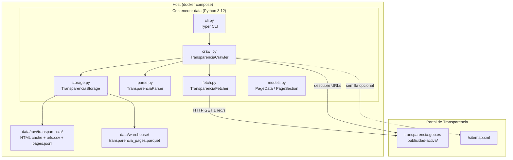
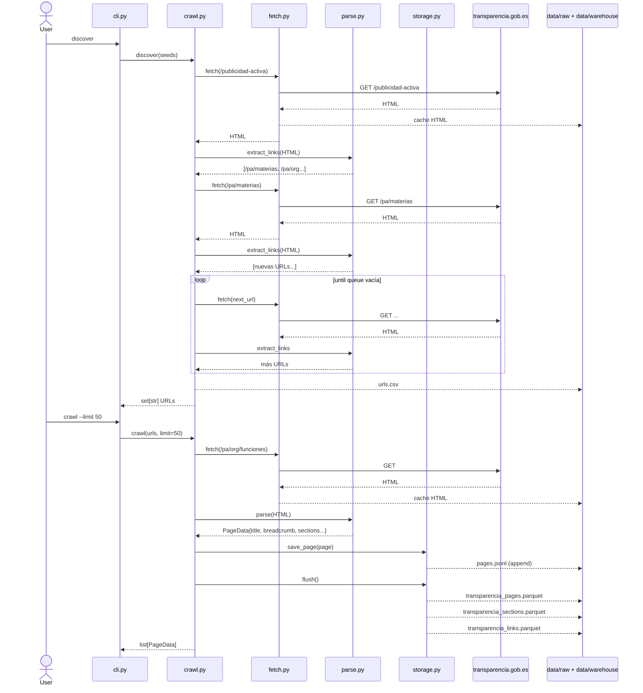

---
tags:
  - civio
  - hackathon
  - scraping
  - transparencia
  - arquitectura
title: "Scraper del Portal de Transparencia (publicidad-activa)"
aliases:
  - Scraper Transparencia
  - Crawler publicidad activa
---

# Scraper del Portal de Transparencia (publicidad-activa)

Scraper respetuoso para recorrer **todos los niveles de Publicidad Activa** del Portal de Transparencia (`transparencia.gob.es`). Descubre URLs por navegación interna (BFS), extrae contenido estructurado sin necesidad de navegador headless, y exporta a Parquet/CSV/JSONL para análisis.

> [!info] Estado
> Implementado como paquete Python dentro del contenedor `data` del [[entorno-dockerizado]]. Código en `packages/data/scrapers/transparencia/`.

---

## 1. Arquitectura



### Flujo de datos



---

## 2. Componentes

### `models.py` — Modelos de datos

| Clase | Campos | Propósito |
|---|---|---|
| `PageData` | url, canonical, status_code, breadcrumb, title, updated_at, sections, accordion_items, external_links, internal_links, crawled_at | Página completa parseada |
| `PageSection` | heading, text | Sección `h2` + contenido siguiente |
| `AccordionItem` | title, content | Item de acordeón `.cmp-accordion__item` |
| `ExternalLink` | url, text | Enlace externo (BOE, `/content/dam/`, target=_blank) |

### `fetch.py` — Cliente HTTP respetuoso

```
TransparenciaFetcher
├── BASE_URL = "https://transparencia.gob.es"
├── rate_limit = 1.0s entre requests
├── cache_dir opcional (SHA256[:16].html + .json metadata)
├── httpx.Client con User-Agent personalizado
├── tenacity: retry 3 intentos, backoff 2-10s
└── fetch(path) → Optional[str] HTML
```

### `parse.py` — Parseo con selectolax

Selectores CSS principales:

| Selector | Extracción |
|---|---|
| `link[rel="canonical"]` | URL canónica |
| `nav.cmp-breadcrumb li` | Breadcrumb (texto + enlaces) |
| `h1.cmp-title__text, h1` | Título de página |
| `main, div.cmp-text` → regex `Actualizado a DD/MM/YYYY` | Fecha de actualización |
| `h2.cmp-title__text, h2` → siguiente `div` | Secciones |
| `.cmp-accordion__item` → title + panel | Acordeones |
| `a[href]` con BOE / `/content/dam/` / `target=_blank` | Enlaces externos |
| `a[href^="/publicidad-activa"]` sin prefijo de idioma | Enlaces internos (navegación) |

Filtros aplicados:
- **Excluye** idiomas: `/ca/`, `/eu/`, `/gl/`, `/va/`, `/en/`
- **Excluye** fragments `#...`
- **Normaliza** rutas: elimina trailing slash

### `crawl.py` — Crawler BFS

```
TransparenciaCrawler
├── discover(seeds?) → set[path]
│   BFS desde semillas, extrae enlaces internos, descubre todo /publicidad-activa
└── crawl(urls, limit?) → list[PageData]
    Itera URLs ordenadas, fetch + parse + save_page, flush al final
```

### `storage.py` — Persistencia

| Output | Ruta | Formato |
|---|---|---|
| HTML cache | `data/raw/transparencia/html/{sha}.html` | Raw HTML + JSON metadata |
| URL inventory | `data/raw/transparencia/urls.csv` | CSV (path) |
| Páginas (append) | `data/raw/transparencia/pages.jsonl` | JSONL (1 línea = 1 página) |
| Páginas analítico | `data/warehouse/transparencia_pages.parquet` | Polars DataFrame |
| Secciones detalle | `data/warehouse/transparencia_sections.parquet` | Polars DataFrame |
| Enlaces detalle | `data/warehouse/transparencia_links.parquet` | Polars DataFrame |

### `cli.py` — Interfaz de comandos

```
python -m scrapers.transparencia [OPTIONS] COMMAND

Commands:
  discover    Descubre todas las URLs bajo /publicidad-activa vía BFS
  crawl       Crawlea páginas y extrae contenido estructurado
  export      Exporta datos a Parquet/CSV

Options:
  -v, --verbose   Debug log
```

---

## 3. Decisiones técnicas

| Decisión | Opción | Motivo |
|---|---|---|
| Sin navegador headless | `httpx` + `selectolax` | El portal entrega navegación y contenido en HTML estático; JS solo controla UI. Playwright sería sobreingeniería. |
| Rate limiting | 1 request/segundo | `robots.txt` no especifica Crawl-delay. Mínima cortesía para servidor público. |
| Cache local | SHA256[:16].html + .json | Evita re-descargar en pruebas iterativas. Ideal para desarrollo. |
| Output dual | JSONL (raw) + Parquet (analítico) | JSONL para depuración y append seguro; Parquet para análisis con Polars/DuckDB. |
| BFS sobre sitemap | Crawl de enlaces como fuente primaria | Sitemap es semilla/cobertura; el crawl descubre URLs no listadas y evita stale links. |

---

## 4. Dependencias

Añadidas a `packages/data/pyproject.toml`:

| Paquete | Uso |
|---|---|
| `httpx` | Cliente HTTP con timeouts y redirects |
| `selectolax` | Parser HTML con selectores CSS (wrapper de Modest) |
| `tenacity` | Reintentos con backoff exponencial |
| `typer` | CLI con autocompletado y --help |

---

## 5. Uso

```bash
# 1. Descubrir URLs
docker compose run --rm data python -m scrapers.transparencia discover

# 2. Crawlear (primeras 50 páginas)
docker compose run --rm data python -m scrapers.transparencia crawl --limit 50

# 3. Crawlear todas (paciencia: ~1000 páginas a 1 req/s ≈ 17 min)
docker compose run --rm data python -m scrapers.transparencia crawl

# 4. Crawlear más rápido (riesgo de rate limiting)
docker compose run --rm data python -m scrapers.transparencia crawl --rate-limit 0.5

# 5. Exportar a CSV
docker compose run --rm data python -m scrapers.transparencia export --format csv

# 6. Debug
docker compose run --rm data python -m scrapers.transparencia crawl --limit 5 -v
```

### Output esperado

```text
data/
├── raw/
│   └── transparencia/
│       ├── html/           ← ~1000 archivos .html + .json (cache)
│       ├── urls.csv        ← todas las URLs descubiertas
│       └── pages.jsonl     ← ~1000 líneas JSON (una por página)
└── warehouse/
    ├── transparencia_pages.parquet       ← ~1000 filas
    ├── transparencia_sections.parquet    ← secciones h2
    └── transparencia_links.parquet       ← enlaces externos
```

---

## 6. Tests

```bash
# Tests del parser (18 casos inline)
docker compose run --rm data python -m pytest tests/scrapers/transparencia/ -v

# Smoke test de conexión Postgres
docker compose run --rm data python -m pytest tests/smoke/ -v
```

Cobertura de `test_parse.py`:

| Test | Verifica |
|---|---|
| `TestCanonical` | Extracción de `link[rel=canonical]` |
| `TestBreadcrumb` | Breadcrumb desde `nav.cmp-breadcrumb` |
| `TestTitle` | `h1.cmp-title__text` y fallback a `h1` plano |
| `TestUpdatedAt` | Regex "Actualizado a DD/MM/YYYY" |
| `TestInternalLinks` | Filtro de rutas `/publicidad-activa`, exclusión de idiomas y fragments |
| `TestSections` | Extracción de `h2` + `div.cmp-text` |
| `TestAccordionItems` | Acordeones `.cmp-accordion__item` |
| `TestExternalLinks` | BOE, `/content/dam/`, target=_blank |

---

## 7. Riesgos y limitaciones

| Riesgo | Mitigación |
|---|---|
| URLs obsoletas en histórico | El crawl descubre desde navegación actual; sitemap como control de cobertura |
| Rate limiting (429) | Tenacity reintenta con backoff; rate limit por defecto conservador |
| Páginas vacías sin JS | Primera comprobación manual. Si ocurre, añadir Playwright como fallback |
| Volumen grande (~1000 páginas) | Crawl progresivo con `--limit` para pruebas parciales |
| Cambios en selectores CSS | Tests inline atrapan regresiones; selectores documentados para mantenimiento |

---

## 8. Estructura de archivos

```
packages/data/
├── pyproject.toml
├── Dockerfile
├── scrapers/
│   ├── __init__.py
│   └── transparencia/
│       ├── __init__.py
│       ├── __main__.py        # python -m entry point
│       ├── models.py          # dataclasses
│       ├── fetch.py           # TransparenciaFetcher
│       ├── parse.py           # TransparenciaParser
│       ├── crawl.py           # TransparenciaCrawler
│       ├── storage.py         # TransparenciaStorage
│       └── cli.py             # typer commands
└── tests/
    ├── __init__.py
    ├── smoke/
    │   └── test_connection.py # Postgres connectivity
    └── scrapers/
        ├── __init__.py
        └── transparencia/
            ├── __init__.py
            └── test_parse.py  # 18 tests

docker-compose.yml              # +volúmenes data/raw, data/warehouse
data/                           # gitignored
├── raw/transparencia/          # cache HTML + JSONL
└── warehouse/                  # Parquet analítico
```

---

## Referencias

- [[informe-repos-civio]] — stack Civio 2026
- [[entorno-dockerizado]] — blueprint del entorno Docker
- [[analisis-monorepo-civio]] — patrones técnicos
- `scrapers/transparencia/` — implementación completa
- `tests/scrapers/transparencia/test_parse.py` — tests del parser
