# Análisis de la Base de Datos del Portal de Transparencia

Schema: `transparencia` — Portal de Transparencia del Gobierno de España (Publicidad Activa).

---

## Esquema de tablas

### `pages` — Páginas rastreadas

| Columna | Tipo | Descripción |
|---|---|---|
| `url` | `text` | URL canónica (PK) |
| `canonical` | `text` | URL canónica alternativa del HTML |
| `status_code` | `integer` | Código HTTP |
| `breadcrumb` | `text[]` | Ruta de navegación en array |
| `title` | `text` | Título de la página (h1) |
| `updated_at` | `date` | Fecha de última actualización |
| `section_count` | `integer` | Cantidad de secciones |
| `accordion_count` | `integer` | Cantidad de acordeones |
| `external_link_count` | `integer` | Enlaces externos |
| `internal_link_count` | `integer` | Enlaces internos |
| `crawled_at` | `timestamptz` | Cuándo se rastreó |
| `materia_raw` | `text` | Materia cruda del path |
| `materia_slug` | `text` | Categoría temática derivada |
| `materia_label` | `text` | Etiqueta legible de la materia |
| `search_tsv` | `tsvector` | Índice de búsqueda textual en español |

### `sections` — Bloques de contenido textual

| Columna | Tipo | Descripción |
|---|---|---|
| `id` | `bigint` | PK |
| `page_url` | `text` | FK a pages.url |
| `ord` | `integer` | Orden estable dentro de la página |
| `heading` | `text` | Título de la sección (h2/h3) |
| `text` | `text` | Cuerpo textual |
| `content` | `text` | Contenido ampliado (puede incluir texto de acordeones) |
| `materia_raw` | `text` | Materia heredada |

### `accordion` — Items de acordeón

| Columna | Tipo | Descripción |
|---|---|---|
| `id` | `bigint` | PK |
| `page_url` | `text` | FK a pages.url |
| `ord` | `integer` | Orden dentro de la página |
| `title` | `text` | Título del acordeón |
| `content` | `text` | Texto del panel expandido |

### `links` — Hipervínculos normalizados

| Columna | Tipo | Descripción |
|---|---|---|
| `id` | `bigint` | PK |
| `source_page_url` | `text` | FK a pages.url |
| `ord` | `integer` | Orden dentro de la página |
| `target_url` | `text` | URL destino |
| `target_host` | `text` | Host del destino |
| `target_path` | `text` | Path del destino |
| `anchor_text` | `text` | Texto visible del enlace |
| `file_extension` | `text` | Extensión (pdf, xls, etc.) |
| `scope` | `text` | Ámbito: `internal`, `external`, `download`, `noise` |
| `is_download` | `boolean` | Es una descarga |
| `is_noise` | `boolean` | Es ruido (navegación, redes sociales) |
| `materia_raw` | `text` | Materia heredada |
| `pattern_id` | `bigint` | FK a link_patterns — regla que lo clasificó |
| `resource_type_id` | `bigint` | FK a resource_types — tipo funcional |

### `link_patterns` — Reglas de clasificación

| Columna | Tipo | Descripción |
|---|---|---|
| `id` | `bigint` | PK |
| `name` | `text` | Nombre de la regla |
| `host_match` | `text` | Regex sobre target_host (NULL = cualquier host) |
| `path_regex` | `text` | Regex sobre target_path (NULL = cualquier ruta) |
| `resource_type_code` | `text` | Código del tipo de recurso |
| `category` | `text` | Categoría funcional |
| `priority` | `integer` | Prioridad (mayor = primera en matchear) |
| `enabled` | `boolean` | Regla activa |

### `resource_types` — Tipos de recurso

| Columna | Tipo | Descripción |
|---|---|---|
| `id` | `bigint` | PK |
| `code` | `text` | Código interno (boe, pap-hacienda, subvenciones, etc.) |
| `label` | `text` | Etiqueta para UI |
| `description` | `text` | Descripción del tipo |

### Vistas

- `v_link_categories` — links con resource_types y link_patterns desnormalizados
- `v_organisms` — resumen por materia (usada por list_organisms)
- `v_search_pages` — pages con search_tsv para búsqueda textual

---

## Datos curiosos

### Panorama general

| Métrica | Valor |
|---|---|
| Páginas rastreadas | **1.167** |
| Enlaces totales | **13.267** |
| Secciones de contenido | **1.402** |
| Acordeones | **320** (en 141 páginas) |
| Enlaces por página (promedio) | ~11 |

### Distribución por materia

| Materia | Páginas |
|---|---|
| Organización y Empleo | **1.043 (89%)** |
| Info Económico-Presupuestaria | 40 |
| Altos Cargos | 26 |
| Trámites | 25 |
| Normativa | 19 |
| Planificación/Estadística | 11 |
| Por Materias | 1 |
| Paley | 1 |

El **89% del portal** es Organización y Empleo.

### Página con más enlaces

**"Cuentas anuales e informes de auditoría"** — 453 enlaces. Le siguen los ejercicios 2018-2021 con ~447 cada uno.

### Ámbito de los enlaces

- **7.393 externos (56%)** — van a otros sitios
- **5.874 descargas (44%)** — PDFs, Excel, etc.

### Hosts externos más enlazados

| Host | Enlaces |
|---|---|
| `pap.hacienda.gob.es` | **4.206 (32%)** |
| `transparencia.sede.gob.es` | 1.167 |
| `boe.es` | 1.101 |

1 de cada 3 enlaces va a la Plataforma de Contratación del Estado.

### Formatos de descarga

| Ext | Cantidad |
|---|---|
| `.aspx` | 4.358 |
| **`.pdf`** | **3.385** |
| `.xls` / `.xlsx` | 2.445 |
| `.php` | 904 |
| `.csv` | solo **6** |

### Secciones por página

- 545 páginas tienen 1 sección
- 389 páginas tienen 0 secciones
- Máximo: 23 secciones en una página

---

## Grafo de dependencias: Altos Cargos

```mermaid
flowchart TD
  idx["🏛 Altos Cargos<br/><i>Página índice</i>"]

  subgraph nucleo["Núcleo temático"]
    condicion["Condición de alto cargo"]
    principios["Principios de buen gobierno"]
    curriculos["Currículums"]
    retribuciones["Retribuciones"]
    retribuciones_ant["Retribuciones<br/>años anteriores"]
    decla_bienes["Declaraciones de<br/>bienes y derechos"]
    obligaciones["Obligaciones AGE"]
    agenda["Agenda"]
  end

  subgraph actividad_privada["Actividad privada tras el cese"]
    ap_cese["Autorizaciones<br/>actividad privada"]
    ap_graficos["Evolución autorizaciones<br/>(gráficos)"]
    ap_seg1["Seguimiento 2019-07"]
    ap_seg2["Seguimiento 2019-09"]
    ap_seg3["Seguimiento 2019-11"]
    ap_seg4["Seguimiento 2020-01"]
    ap_seg5["Seguimiento 2020-03"]
    ap_seg6["Seguimiento 2020-04"]
    ap_seg7["Seguimiento 2020-05"]
    ap_seg8["Seguimiento 2020-07"]
    ap_seg9["Seguimiento 2020-09"]
    ap_seg10["Seguimiento 2021-11"]
  end

  subgraph indemnizaciones["Indemnizaciones por abandono"]
    ind_main["Indemnizaciones"]
    ind_seg1["Seguimiento 2019-06"]
    ind_seg2["Seguimiento 2020-06"]
    ind_seg3["Seguimiento 2020-12"]
    ind_seg4["Seguimiento (general)"]
  end

  subgraph externas["Dependencias externas"]
    boe["📜 BOE<br/><i>Ley 3/2015 + 38 resoluciones</i>"]
    sede["🏢 Sede Electrónica<br/><i>transparencia.sede.gob.es</i>"]
    buscador["🔍 Buscador currículums"]
    oci["⚖ Oficina Conflictos<br/>de Intereses"]
    pdfs["📄 Descargas PDF<br/><i>24 informes</i>"]
  end

  idx --> condicion
  idx --> principios
  idx --> curriculos
  idx --> retribuciones
  idx --> decla_bienes
  idx --> obligaciones
  idx --> agenda
  idx --> ap_cese
  idx --> ind_main

  retribuciones --> retribuciones_ant

  ap_cese --> ap_graficos
  ap_cese --> ap_seg1
  ap_cese --> ap_seg2
  ap_cese --> ap_seg3
  ap_cese --> ap_seg4
  ap_cese --> ap_seg5
  ap_cese --> ap_seg6
  ap_cese --> ap_seg7
  ap_cese --> ap_seg8
  ap_cese --> ap_seg9
  ap_cese --> ap_seg10

  ind_main --> ind_seg1
  ind_main --> ind_seg2
  ind_main --> ind_seg3
  ind_main --> ind_seg4

  curriculos --> buscador
  obligaciones --> boe
  obligaciones --> sede
  obligaciones --> oci
  obligaciones --> pdfs
  decla_bienes --> boe
  decla_bienes --> sede
  ap_cese --> boe
  ap_cese --> sede
  ind_main --> boe
  ind_main --> sede
  principios --> boe

  classDef default fill:#f0f4ff,stroke:#333,stroke-width:1px,color:#000
  classDef external fill:#fff3e0,stroke:#e65100,stroke-width:1px,color:#000
  classDef groupTitle fill:none,stroke:#666,stroke-width:2px,color:#444,stroke-dasharray:5 5

  class boe,sede,buscador,oci,pdfs external
```

---

## 10 PDFs destacados para descargar

| # | Archivo | Tema |
|---|---|---|
| 1 | `.../msnd/MSND_LXIV.pdf` | Organigrama del Ministerio de Sanidad |
| 2 | `.../mfom/ORG-MFOM-OP-SEPES.pdf` | Entidad Pública Empresarial del Suelo (SEPES) |
| 3 | `.../6F9F-7C99-Plan2013.pdf` | Plan de Comunicación Institucional 2013 |
| 4 | `.../mtec/aemet/RPT-AEMET-PL.pdf` | RPT personal laboral — AEMET |
| 5 | `.../informe_1_semestre_18.pdf` | Informe altos cargos 1er semestre 2018 |
| 6 | `.../mecd/ORG-MECD-OP-UIMP.pdf` | Organigrama UIMP |
| 7 | `.../migd/250901-RPT-IGU-50716-PL.pdf` | RPT personal laboral — Ministerio Igualdad |
| 8 | `.../meyss/MEmpleoSeguridadSocial.pdf` | Organigrama Ministerio Empleo |
| 9 | `.../mint/tpfe/230901-RPT-X8X11-1303-PF.pdf` | RPT personal funcionario — Interior |
| 10 | `.../mtms/201201-RPT-TSS-PF.pdf` | RPT personal funcionario — Trabajo |

Todas las URLs base: `https://transparencia.gob.es/content/dam/transparencia_home/...`
