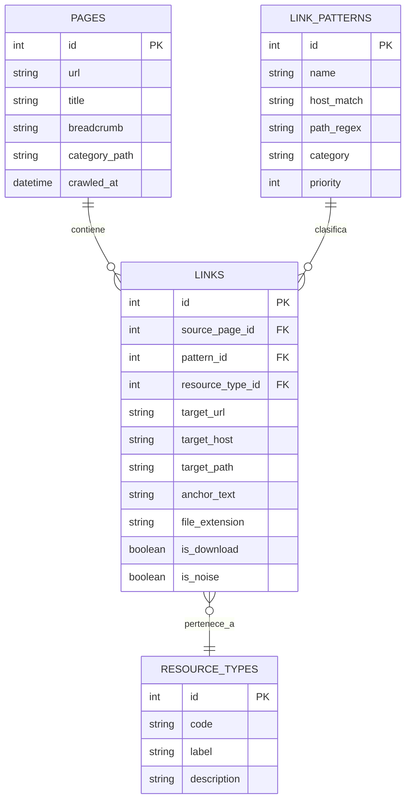

# Modelo de datos de hipervinculos del Portal de Transparencia

> [!info]
> Modelo simple para explotar los patrones detectados en los enlaces extraidos del scraper: navegacion interna, recursos descargables, BOE, PAP Hacienda, subvenciones y ruido.

## Diagrama simple

## Tipos iniciales

| `code` | Regla principal | Uso en MVP |
|---|---|---|
| `internal_page` | `target_host = transparencia.gob.es` y ruta `/publicidad-activa/...` | Navegacion y contexto de seccion |
| `download` | `/content/dam/...` o extension `.pdf`, `.xls`, `.xlsx`, `.csv`, `.ods` | Recursos descargables mostrables como tarjetas |
| `pap_hacienda` | `www.pap.hacienda.gob.es` o `www.pap.minhafp.gob.es` | Cuentas anuales, auditorias, XBRL/Recuenta |
| `boe` | `www.boe.es` o `boe.es` | Normativa y disposiciones oficiales |
| `subvenciones` | `www.infosubvenciones.es` o rutas `bdnstrans` | Subvenciones y concesiones |
| `sede` | `transparencia.sede.gob.es` | Acceso administrativo, normalmente auxiliar |
| `noise` | `javascript:void(0)`, `#...`, textos como `Ir al contenido` | Filtrar antes de indexar o mostrar |

## Lectura del modelo

- `PAGES` representa cada pagina rastreada del portal.
- `LINKS` representa cada hipervinculo normalizado y conserva el texto de ancla.
- `LINK_PATTERNS` permite clasificar por reglas editables sin tocar los datos originales.
- `RESOURCE_TYPES` traduce reglas tecnicas a categorias entendibles para la UI.

## MVP soportado

Con este modelo se puede construir un explorador ciudadano de recursos:

- buscar por texto de pagina, breadcrumb o ancla;
- filtrar por tipo de recurso (`PDF`, `XLS`, `BOE`, `subvenciones`, `cuentas`);
- ocultar ruido y navegacion repetida;
- mostrar tarjetas con titulo, categoria, formato y enlace real.
